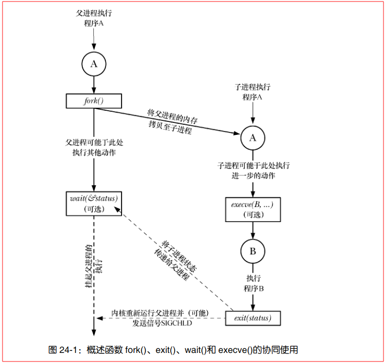

# fork()、exit()、wait()以及execve()的简介->important

> - 系统调用 **fork()**

- 允许一进程（父进程）创建一新进程（子进程）。
- 新的子进程几近于对父进程的翻版：**子进程获得父进程的栈、数据段、堆和执行文本段（6.3 节）的拷贝**

> - 库函数 **exit（status）**

- 终止一进程，**将进程占用的所有资源（内存、文件描述符等）归还内核**，交其进行再次分配。
- 参数 status 为一整型变量，表示进程的退出状态。父进程可使用系统调用wait()来获取该状态。

> - 系统调用**wait（&status**）

- 如果子进程尚未调用 exit()终止，那么**wait()会挂起父进程直至子进程终止；**
- **子进程的终止状态通过wait()的status 参数返回**

> - 系统调用 **execve(pathname，argv，envp)**

- 加载一个新程序（路径名为 pathname，参数列表为 argv，环境变量列表为 envp）到当前进程的内存。
- 这将**丢弃现存的程序文本段，并为新程序重新创建栈、数据段以及堆**
- 通常将这一动作**称为执行（execing）一个新程序**
  
## fork()、exit()、wait()以及execve()关系图
> 
> - 图中对execve()的调用并非必须。
> - 最终,总是要**通过调用exit()（或接收一个信号）来终止子进程**，而父进程可调用wait()来获取其终止状态。

---
# 创建新进程：fork()
- 
