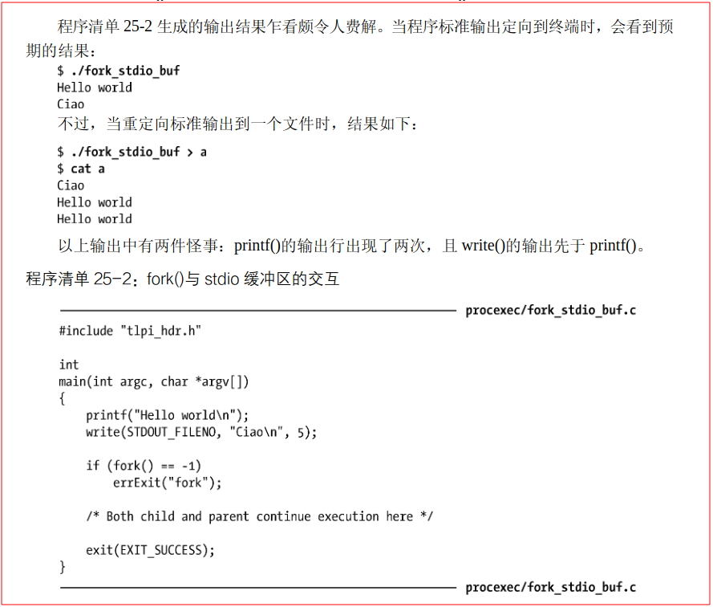

# 进程的终止：_exit()和exit()
- 进程终止方式：
    1. 异常（abnormal）终止
        - 由对一信号的接收而引发，该信号的默认动作为终止当前进程，**可能产生核心转储（core dump）**
    2. 使用_exit()系统调用正常（normally）终止

> **`void _exit(int status);`**--->系统调用
> #include<unistd.h>

- status 参数定义了进程的终止状态（termination  status），父进程可调用 wait()以获取该状态
  - > `pid_t wait(int *status);`
    - wait()函数会阻塞调用进程，直到有一个子进程终止。
    - **status参数是一个指向整型的指针，用于获取子进程的退出状态**。 
    - 如果当前没有子进程，wait()函数会立即返回-1，并且errno被设置为ECHILD。
    - 如果有一个子进程终止，则wait()函数会返回该子进程的pid，**并将退出状态存储到status指向的变量中**。
    - 可以使用waitpid()函数来等待指定的子进程终止。
  - **_exit(0)表示进程成功退出**
  - **_exit(非0值)表示异常退出**
  - status定义为int 类型，但**仅有低8 位可为父进程所用**(0~255)，且取值大于128 将在shell 脚本中引发混乱
    - 原因：当以信号（signal）终止一命令时，shell 会将变量$?置为 128 与信号值之和
    >例题：如果子进程调用 exit(-1)，父进程将会看到何种退出状态（由 WEXITSTATUS()返回）？
    >    - 父进程将会看到退出状态为255。这是因为exit()函数中的**参数被解释为无符号字符**，而-1在转换为无符号字符时等于255

> **`void exit(int status);`**--->库函数调用
> #include<stdlib.h>

- 程序一般不会直接调用_exit()，而是**调用库函数 exit()**，它**会在调用_exit()前执行各种动作**
    - exit()会执行的动作如下：
      - 调用退出处理程序（通过 atexit()和 on_exit()注册的函数），其执行顺序与注册顺序相反
      - **刷新stdio 流缓冲区**
      - 使用由status 提供的值执行_exit()系统调用

- 执行return n **等同于**执行对exit(n)的调用
  
---
# 进程终止的细节
- 无论进程是否正常终止，都会发生如下动作
    1. 关闭所有打开文件描述符、目录流、信息目录描述符），以及（字符集）转换描述符
    2. 作为文件描述符关闭的后果之一，将释放该进程所持有的任何文件锁
    3. 分离（detach）任何已连接的System V 共享内存段，且对应于各段的shm_nattch 计数器值将减一
    4. 进程为每个System V 信号量所设置的semadj 值将会被加到信号量值中
    5. 如果该进程是一个管理终端（terminal ）的管理进程，那么系统会向该终端前台（foreground）进程组中的每个进程发送SIGHUP 信号，接着终端会与会话（session）脱离
    6. 将关闭该进程打开的任何POSIX 有名信号量，类似于调用sem_close()
    7. 将关闭该进程打开的任何POSIX 消息队列，类似于调用mq_close()。
    8. 作为进程退出的后果之一，如果某进程组成为孤儿，且该组中存在任何已停止进程（stopped processes），则组中所有进程都将收到SIGHUP 信号，随之为SIGCONT 信号
    9. 移除该进程通过mlock()或mlockall()所建立的任何内存锁
    10. 取消该进程调用mmap()所创建的任何内存映射（mapping）

---
# 退出处理程序
P442

---
# fork()、stdio 缓冲区以及_exit()之间的交互

> 问题一：结果输出到终端时，`先hello再ciao`；而重定向到文件时，文件里存的内容是`先ciao，再两个hello`

- 答一(1)：
  1. 进程的用户空间内存中维护 stdio 缓冲区
  2. 通过 **fork()创建子进程时会复制这些缓冲区**
  3. 当`标准输出定向到终端时`，因为**缺省为行缓冲**，所以会立即显示函数printf()输出的包含换行符的字符串。
  4. 当`标准输出重定向到文件时`，由于**缺省为块缓冲**，所以在本例中，当调用 fork()时，printf()**输出的字符串仍在父进程的 stdio 缓冲区中**，并随子进程的创建而产生一份副本。父、子进程**调用exit()时会刷新各自的 stdio 缓冲区**，从而导致重复的输出结果。
- 答一(2):
  - write()的输出并未出现两次，这是因为**write()会将数据直接传给内核缓冲区，fork()不会复制这一缓冲区**
  - write()的输出结果先于printf()而出现，是因为 **write()会将数据立即传给内核高速缓存**，而 printf()的输出则需要等到调用exit ()刷新stdio 缓冲区时

> 问题二：当执行exit函数时才会调用print函数进行输出吗
- 答二：
    1. 不完全正确
    2. **调用 exit() 函数时，会刷新缓冲区，并将缓冲区中的内容输出**，如果缓冲区中没有内容，则不会输出任何信息
    3. **调用 printf() 函数时，会将字符串输出到缓冲区中**，直到**缓冲区满或者遇到换行符**等特定情况**才会将缓冲区中的内容输出**
    4. 如果在调用 printf() 函数之后没有调用 exit() 函数，但是缓冲区已经满了，那么缓冲区中的内容**也会被输出**
    5. 如果在程序执行完毕后，没有调用 exit() 函数也没有满足缓冲区输出的条件，那么缓冲区中的内容**不会被输出**

> 问题三：缺省为行缓冲、块缓冲？   --->缺省：默认情况下
- 答三：
    1. 行缓冲指的是**缓冲区在遇到换行符时进行刷新**
    2. 块缓冲指的是**缓冲区满后进行刷新**
    3. 在标准输出定向到终端时，由于缺省为行缓冲，所以当调用 printf() 函数输出**包含换行符的字符串时，缓冲区会立即被刷新并输出到终端上**
    4. 当标准输出定向到文件时，缺省为块缓冲，因此**缓冲区在满时才会被刷新并输出到文件中**
    5. `图片中的重定向是块缓冲，由于父子进程缓冲区中都有hello，虽然缓冲区没有满，但调用了exit，也把缓冲区给刷新了，使之写入指定文件中`

> 问题：`write(stdout_fileno,"ciao\n",5)`是什么意思
- 答四：
    1.  **使用write函数将字符串"ciao\n"写入到标准输出流stdout中**
    2.  stdout_fileno函数返回标准输出流stdout的文件描述符，然后将该文件描述符作为write函数的第一个参数。
        - stdout_fileno是一个函数，它用于获取标准输出流stdout的文件描述符。在C语言中，stdout是一个指向标准输出流的文件指针，可以**使用它来输出数据到控制台**  
    3.  第二个参数是要写入的数据的指针，即字符串"ciao\n"
    4.  第三个参数是要写入的字节数，即5，表示要写入字符串的前5个字符
    5.  因此，**这行代码的作用是将字符串"ciao\n"输出到控制台上，即打印出"ciao"并换行**

### 解决方案
1. **在调用 fork()之前使用函数 `fflush()`来刷新stdio 缓冲区**，也可以使用setvbuf()和setbuf()来关闭stdio 流
的缓冲功能
    - 例如，在 printf() 函数调用之后添加 fflush(stdout) 来刷新标准输出缓冲区。

2.  **`子进程`可以调用_exit()** 而非 exit()，以便不再刷新 stdio 缓冲区
    - 因为exit()会执行的动作如下：
      - 调用退出处理程序（通过 atexit()和 on_exit()注册的函数），其执行顺序与注册顺序相反
      - **刷新stdio 流缓冲区**
      - 使用由status 提供的值执行_exit()系统调用
    - 在创建子进程的应用中，典型情况下仅有一个进程（一般为**父进程）应通过调用 exit()终止**，而**其他进程应调用_exit()终止**，从而确保只有一个进程调用退出处理程序并刷新stdio 缓冲区

---
# 总结
- 进程的终止分为正常和异常两种。异常终止可能是由于某些信号引起，其中的一些信号还可能导致进程产生一个核心转储文件。 
- 正常的终止可以通过调用_exit()完成，更多的情况下，则是**使用_exit()的上层函数 exit()完成**。
- _exit()和exit()都需要一个整型参数，其**低8 位定义了进程的终止状态**。
- 依照惯例，**状态0用来表示进程成功完成，非0 则表示异常退出**。 
- 不管进程正常终止与否，内核都会执行多个清理步骤。
- 调用exit()正常终止一个进程，将会引发执行经由atexit()和on_exit()注册的退出处理程序（执行顺序与注册顺序相反），**同时刷新stdio 缓冲区**。